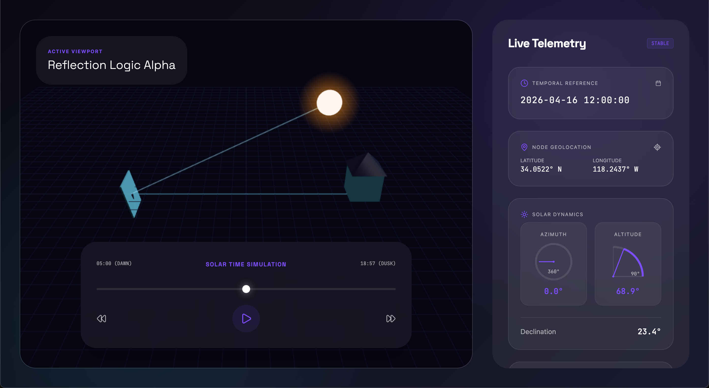

# Helios Tracker

A real-time solar tracking simulation with 3D visualization and motor control calculations.


> 📖 [中文版](./README_zh.md)

## Features

- 🌞 Real-time solar position calculation (altitude & azimuth)
- 🪞 Motor angle calculation using bisector method
- 🌍 Timezone-synchronized (Asia/Shanghai UTC+8)
- 🎮 Time simulation with play/pause/fast-forward/rewind controls
- 📅 Date picker for historical/future simulation
- 🎨 3D visualization with Three.js
- 📊 Live telemetry dashboard

## Screenshots



## Quick Start

### Development

```bash
# Backend (terminal 1)
cd api
python -m uvicorn main:app --reload --port 8000

# Frontend (terminal 2)
cd frontend
npm install
npm run dev
```

Open http://localhost:3000 - frontend proxies API requests to backend.

### Production Build

```bash
# Build frontend
cd frontend
npm run build

# Run API (serves frontend from frontend/dist)
cd ../api
python -m uvicorn main:app --port 8000
```

## Configuration

Edit `api/main.py` to change default parameters:

```python
config = {
    "lat": 31.23,           # Latitude
    "lon": 121.47,         # Longitude
    "target_azimuth": 25.0, # Target reflection direction
    "target_altitude": 10.0, # Target reflection elevation
    "timezone": "Asia/Shanghai"
}
```

## API Endpoints

| Endpoint | Description |
|----------|-------------|
| `GET /` | Main UI |
| `GET /calculate` | Get sun position & motor angles |
| `GET /sunrise_sunset` | Get sunrise/sunset times |

## Architecture

```
helios-tracker/
├── frontend/                 # React + Vite + Three.js
│   ├── src/
│   │   ├── components/       # UI components
│   │   ├── lib/             # Solar calculations
│   │   ├── App.tsx           # Main app
│   │   └── main.tsx          # Entry point
│   ├── package.json
│   └── vite.config.ts       # Vite config with proxy
│
├── api/                      # FastAPI Python backend
│   ├── main.py              # FastAPI server
│   ├── tracker_logic.py    # pysolar calculations
│   └── static/              # Built frontend (production)
│
├── pyproject.toml           # Python dependencies
├── package.json             # Node dependencies (for reference)
└── README.md               # This file
```

## Tech Stack

- **Frontend**: React 19, TypeScript, Three.js, Tailwind CSS v4, Framer Motion, Lucide React
- **Backend**: FastAPI, pysolar, pytz
- **Build**: Vite, UV package manager

## License

See [LICENSE](./LICENSE) for details.