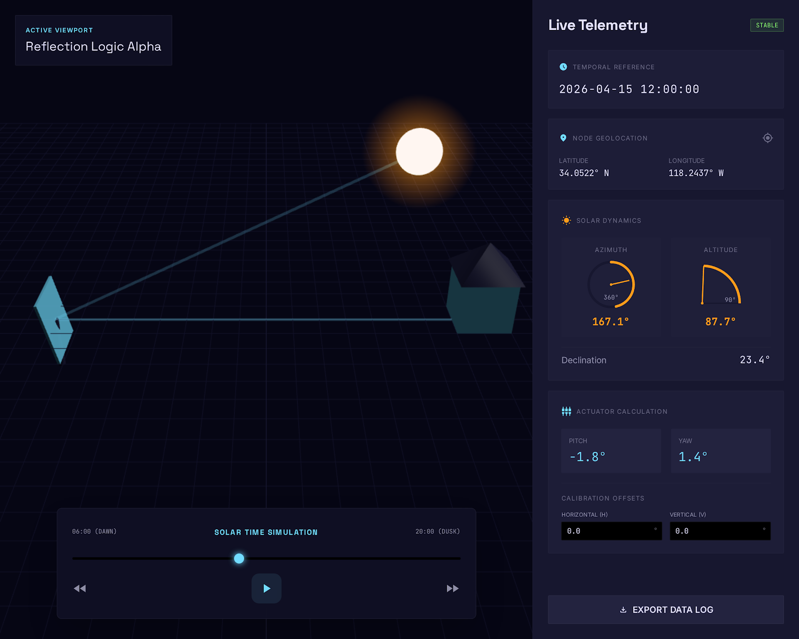

> 我写这个项目的目的，就是想让我家能有更多的时间接受太阳光的照射，想到了用镜子追踪太阳然后反射进房间的方案

# 太阳反射镜追踪器

一款实时太阳追踪与反射，整合地理感知与天文算法，计算并输出高精度的双轴电机控制参数的 3D 模拟器。


> 📖 [English Version](./README.md)

## 截图



## 功能特性

- 🌞 实时太阳位置计算（高度角 & 方位角）
- 🪞 使用平分法计算电机角度
- 🌍 时区同步（亚洲/上海 UTC+8）
- 🎮 时间模拟：播放/暂停/快进/快退控制
- 📅 日期选择器：支持历史/未来模拟
- 🎨 Three.js 3D可视化
- 📊 实时遥测仪表盘

## 快速开始

```bash
# 安装依赖
uv sync
# 运行服务器
uv run uvicorn api.main:app --reload
# 浏览器打开
http://localhost:8000
```

## 配置参数

编辑 `main.py` 修改默认参数：

```python
config = {
    "lat": 31.23,           # 纬度
    "lon": 121.47,         # 经度
    "target_azimuth": 25.0, # 目标反射方向与正北方向的夹角
    "target_altitude": 10.0, # 目标反射高度与水平面的夹角
    "timezone": "Asia/Shanghai"
}
```

## API 接口

| 接口 | 描述 |
|------|------|
| `GET /` | 主界面 |
| `GET /calculate` | 获取太阳位置和电机角度 |
| `GET /sunrise_sunset` | 获取日出日落时间 |

## 项目结构

```
solar/
├── api/
│   ├── main.py           # FastAPI 服务器和配置
│   └── tracker_logic.py  # pysolar 太阳计算逻辑
├── index.html            # 嵌入式 Three.js 界面
├── pyproject.toml        # 项目依赖
├── vercel.json           # Vercel 部署配置
├── AGENTS.md             # 开发指南
├── .gitignore            # Git 忽略规则
└── README_zh.md          # 中文说明
```

## 技术栈

- **后端**: FastAPI, pysolar, pytz
- **前端**: Three.js, Tailwind CSS, 原生 JavaScript
- **构建**: UV 包管理器

## 许可证

See [LICENSE](./LICENSE) for details.